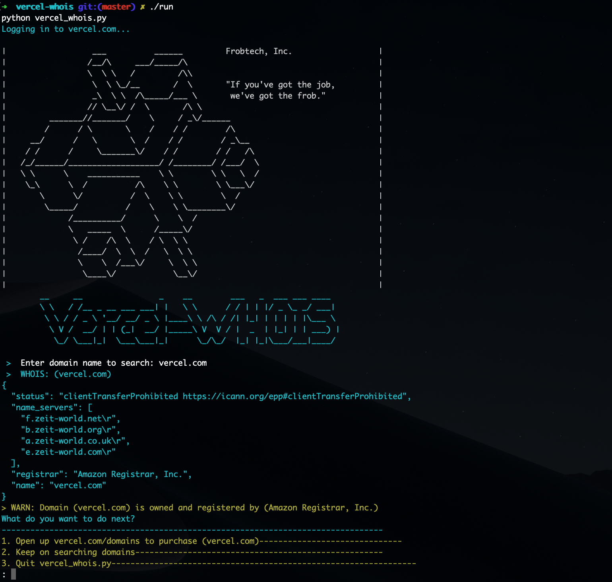

<h1 align="center">
  Vercel-WHOIS
</h1>

<p align="center">
  <a href="https://vercel.com">
    
  </a>
</p>

<p align="center">
  <a href="https://github.com/navalmonga/pywhois/blob/master/LICENSE">
    
  </a>
  
</p>

<p align="center">
  
</p>

---

## Getting Started

### Prerequisites

- Pyenv

```
curl https://pyenv.run | bash

pyenv install 2.7.15
pyenv gloabl 2.7.15
which python
```

- Add to `~/.zshrc`

```
# Load pyenv automatically
export PATH="$HOME/.pyenv/bin:$PATH"
eval "$(pyenv init -)"
eval "$(pyenv virtualenv-init -)"
```


## Usage (macOS/Linux)

```
make install-python; make install; make
```

Generates domain names for startups and cross-checks if the domain name exists. Shows the user a name with available domain names.

Requirements:

- Find a wordlist of some kind
  - Possibly animal name, common names
- Randomly select a word from the list
- Open up [Vercel](https://vercel.com/domains)
- Look up domain name
- If the .com is available, then print to sreen
- Let user decide if continue or open the site

[Credits](https://www.youtube.com/watch?v=7wB3cTma0xs)

[Makefile credits](https://krzysztofzuraw.com/blog/2016/makefiles-in-python-projects)